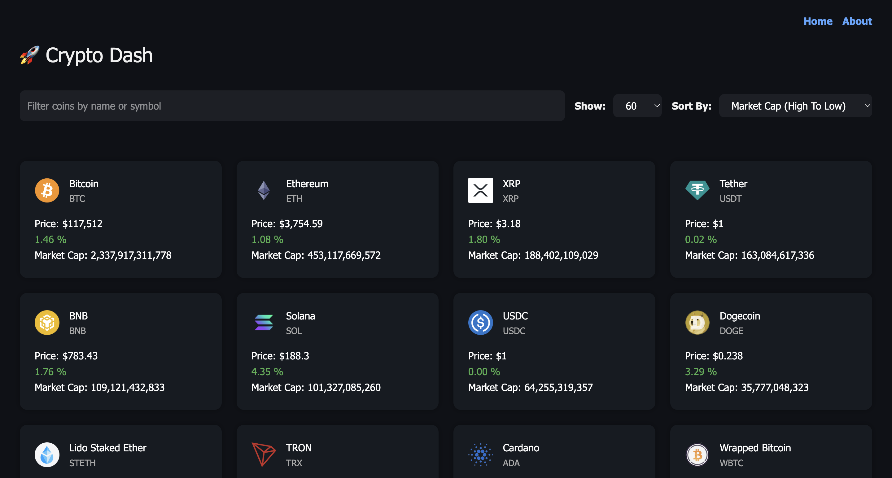

# 🚀 CryptoTracker

A responsive React app that displays real-time cryptocurrency market data, prices, and charts using the CoinGecko API v3.0.1. This app features sorting, filtering, dynamic routing, and chart visualizations built with React.js, Chart.js and Tailwind CSS.

---

### 🖇️ Live :

[https://crypto.ahmedrehandev.net](https://crypto.ahmedrehandev.net)

---

### 📸 Screenshot :

---

### 🛠️ Tech Stack :

- Framework: React
- Styling: Tailwind CSS
- Charting: Chart.js
- Routing: React Router
- API: CoinGecko Market Chart Range API
- State Management: useState, useEffect

---

### 📦 Features :

- Fetches live market data and coin info
- Displays coin symbol, name, market cap, and price
- Interactive chart for price history
- Filter and sort functionality
- Responsive and mobile-friendly UI
- Custom 404 Page
- SPA Navigation with React Router

---

### 📄 License :

This project is licensed under the MIT License.
Feel free to use, modify, and distribute it.
